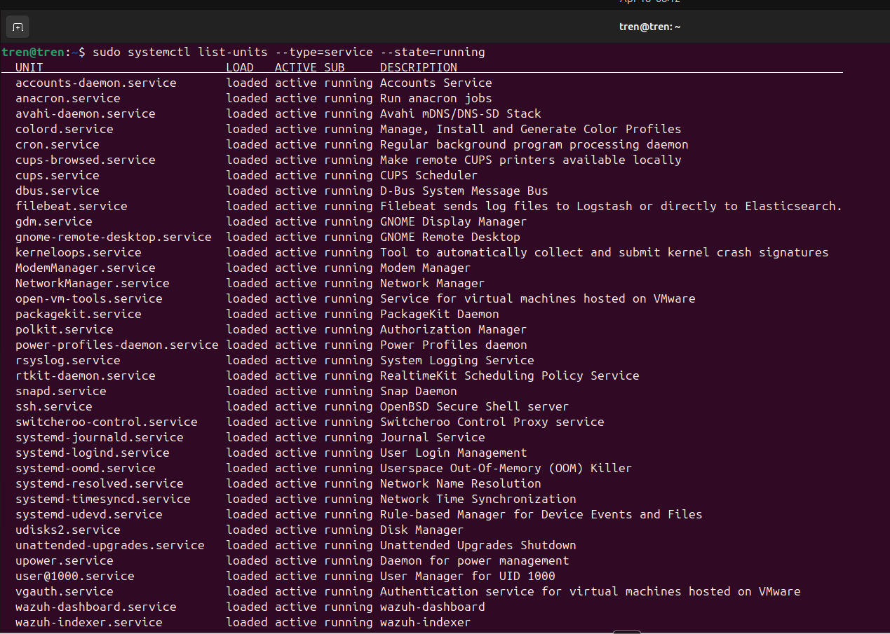
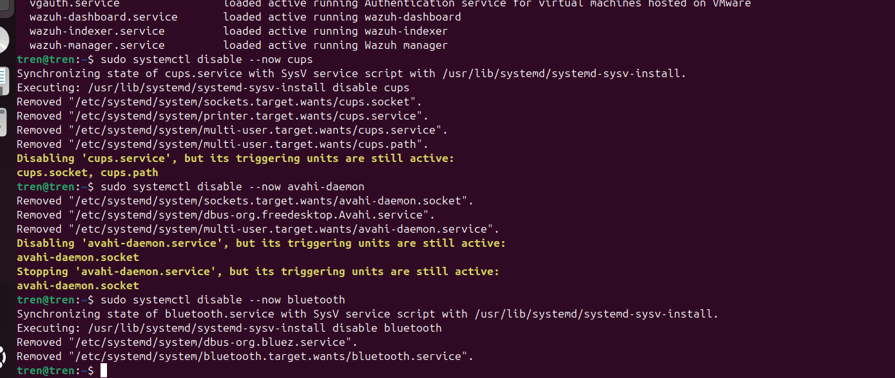
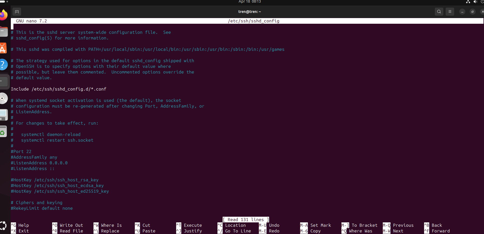
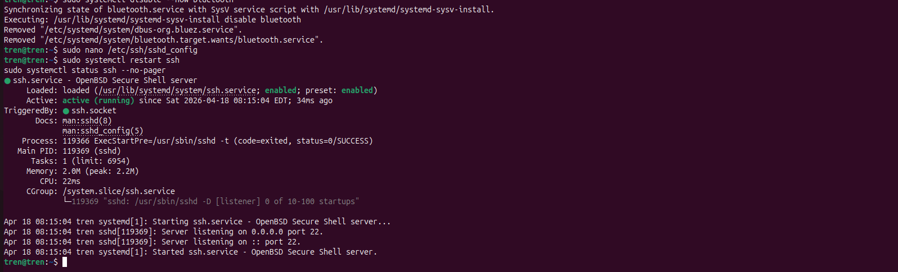
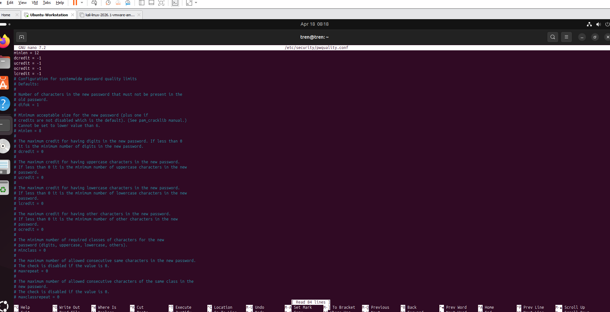
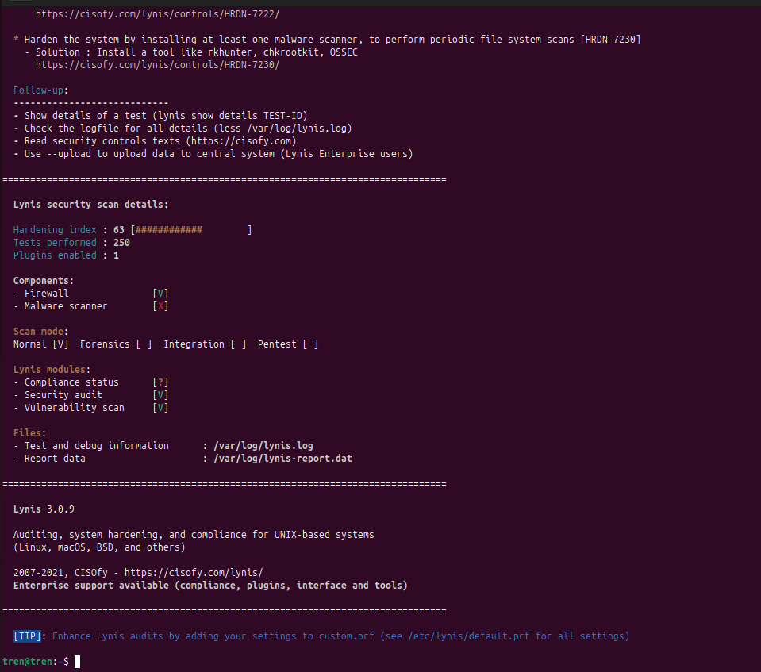
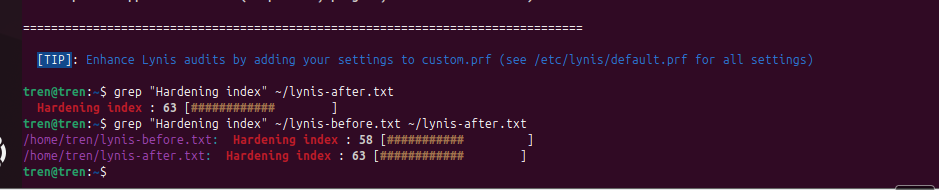
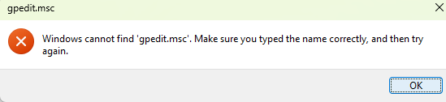
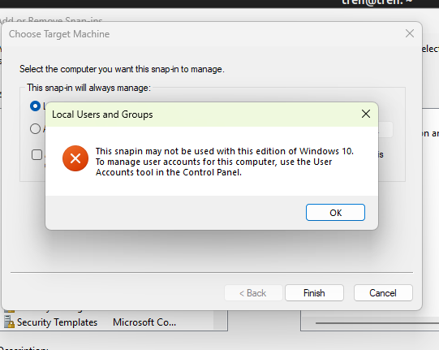
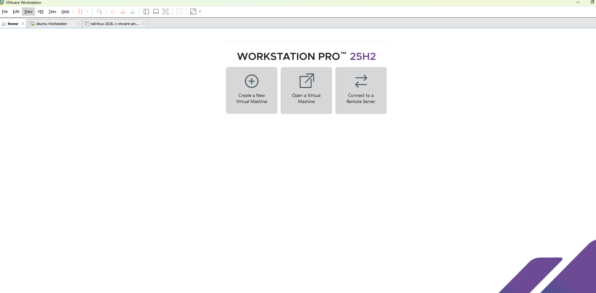

# Hardening Checklists

Hands-on hardening lab focused on reducing attack surface and improving Ubuntu security posture with measurable before-and-after results.

---

## Tools Used
- Lynis
- systemctl
- OpenSSH
- unattended-upgrades
- libpam-pwquality
- VMware Workstation Pro

---

## What This Lab Demonstrates
- Running a baseline hardening audit with Lynis
- Disabling unnecessary services to reduce attack surface
- Hardening SSH configuration
- Enforcing stronger password policy with PAM
- Measuring hardening progress with before-and-after scoring
- Documenting environment limitations honestly

---

## Key Findings
- Ubuntu Lynis hardening score improved from **58 → 63**
- Disabled unnecessary services: `cups`, `avahi-daemon`, `bluetooth`
- Applied SSH hardening controls: root login blocked, auth attempts capped, forwarding disabled
- Enforced password quality: minimum 12 characters, mixed character requirements
- Windows half blocked — Windows Server 2022 VM was not available in VMware Workstation Pro

---

## Screenshots

| Screenshot | What it shows |
|---|---|
|  | Active services on Ubuntu before hardening |
|  | Disabling cups, avahi-daemon, and bluetooth |
|  | SSH config open in nano for hardening |
|  | SSH service active after config changes |
|  | Password policy settings applied |
|  | Lynis hardening index at 63 after changes |
|  | Before/after grep showing 58 → 63 |
|  | gpedit.msc missing — confirms Windows 11 Home |
|  | MMC snap-in blocked on Home edition |
|  | VMware showing no Windows Server 2022 VM |

---

## Notes
This lab is documented as a partial completion. The Linux side was completed and produced measurable results. The Windows side was not completed because the required Windows Server 2022 environment was not present in VMware Workstation Pro — confirmed by the absence of the VM and the gpedit.msc restriction on the Windows 11 Home host.

---

## Blue Team Takeaway
Hardening work is about reducing exposure, proving the improvement, and documenting the environment accurately. Even partial completion has value when the technical evidence is clear and honest.
