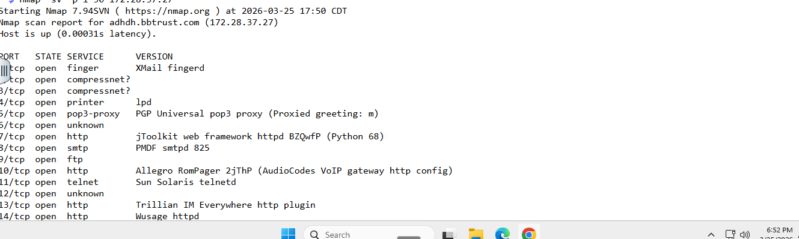
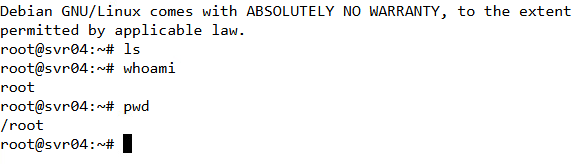
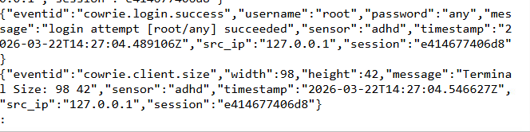
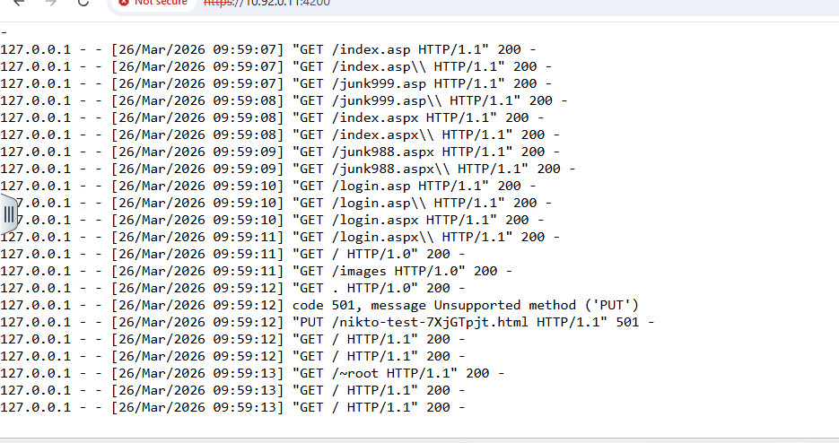

# Active Defense & Cyber Deception Lab

## Overview

This lab demonstrates how active defense and cyber deception techniques can be used to detect, mislead, and analyze attacker behavior. Tools including Canary Tokens, Portspoof, Cowrie, and Spidertrap were used to simulate real-world defensive strategies.

---

## Tools Used

* Canary Tokens
* Portspoof
* Cowrie (SSH Honeypot)
* Spidertrap (Web Deception)

---

## Lab Breakdown

### Canary Tokens (Detection & Attribution)

Canary tokens were used to detect unauthorized access. When the token was triggered, an alert provided details such as source IP, timestamp, and user-agent information.

---

### Portspoof (Annoyance)

Portspoof was configured to return misleading service information. Nmap scans produced confusing and inaccurate results, slowing attacker reconnaissance efforts.

---

### Cowrie Honeypot (Attribution)

Cowrie simulated an SSH service and captured attacker interaction. Login attempts and commands such as `ls`, `whoami`, and `pwd` were recorded for analysis.

---

### Spidertrap (Web Deception)

Spidertrap simulated a web server and logged reconnaissance activity. A Nikto scan generated multiple requests, all of which were captured and recorded.

---

## Screenshots

### Portspoof Results

### Cowrie SSH Session

### Cowrie Logs

### Spidertrap Logs

---

## Key Takeaways

* Active defense can detect attackers early
* Deception slows down and misleads attackers
* Honeypots capture attacker behavior
* Logging provides valuable threat intelligence

---

## Skills Demonstrated

* Network scanning and analysis (Nmap, Nikto)
* Honeypot deployment and monitoring
* Log analysis
* Cyber deception implementation

---

## Impact

This lab demonstrates real-world defensive cybersecurity techniques by simulating attacker behavior and capturing actionable intelligence, a critical capability for SOC analysts and cyber defense professionals.
