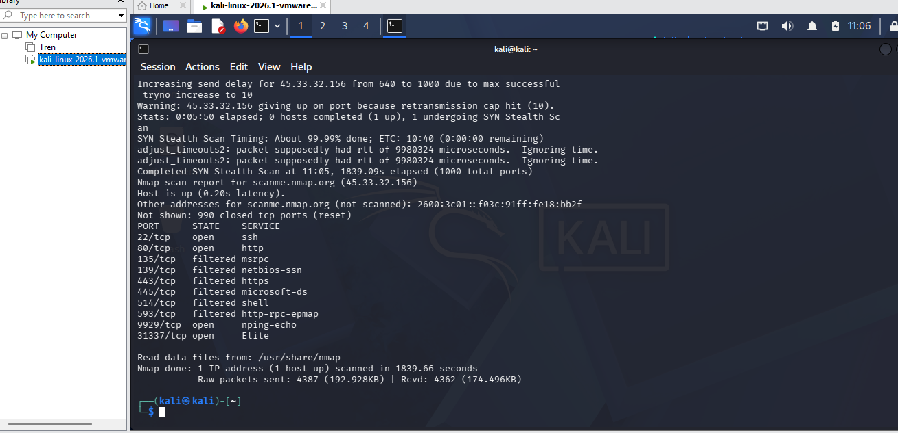

# Lab 1: Network Reconnaissance with Nmap

## Objective
Perform network reconnaissance on a target host to identify open ports,
running services, and potential attack surface.

## Tools Used
- Kali Linux (VMware)
- Nmap

## Target
- Host: scanme.nmap.org
- IP: 45.33.32.156
- Note: This is a legally authorized practice target provided by Nmap

## Scan Command
```bash
nmap -v scanme.nmap.org
```

## Results

| Port | State | Service |
|------|-------|---------|
| 22/tcp | open | SSH |
| 80/tcp | open | HTTP |
| 9929/tcp | open | Nping-echo |
| 31337/tcp | open | Elite |
| 135, 139, 443, 445, 514, 593 | filtered | Blocked by firewall |

## Analysis
- Port 22 open = remote login possible via SSH
- Port 80 open = web server is actively running
- Filtered ports indicate a firewall is protecting those services
- 990 ports were closed

## Screenshot


## What I Learned
Performed my first SYN Stealth Scan using Nmap, identifying open services
and firewall-filtered ports on a live target. This technique is used by
SOC analysts and penetration testers to map network exposure.