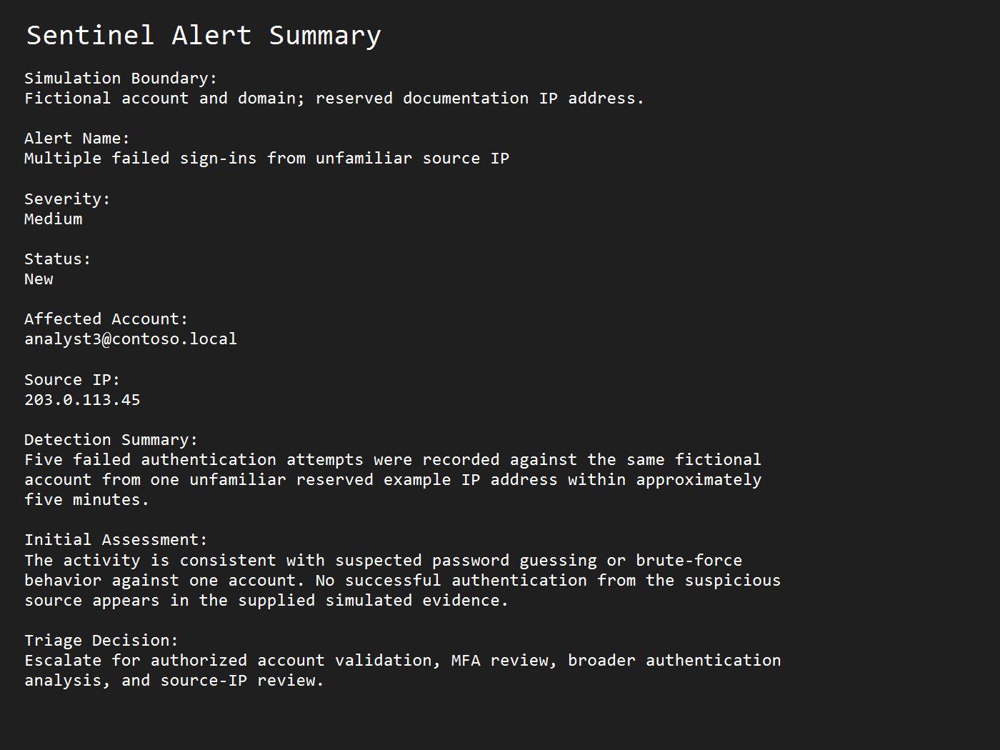
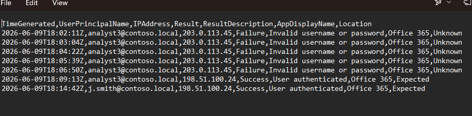
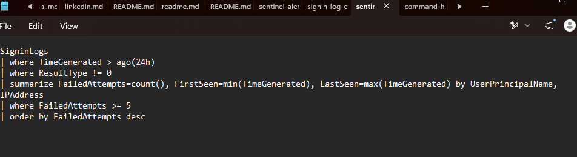

# SOC-011 Microsoft Sentinel Alert Triage

## Recruiter Summary

This simulated SOC case demonstrates triage of repeated failed Microsoft Entra ID-style sign-ins from one unfamiliar external source IP. I reviewed the alert context, analyzed the authentication events, used KQL-style logic to group the failures, documented the evidence, and produced an escalation decision with approval-controlled response options.

## Simulation Boundary

This is a controlled portfolio case built from simulated Microsoft Sentinel-style and Microsoft Entra ID-style telemetry. No live Microsoft Sentinel tenant, production environment, real user account, or company data was accessed. All accounts and domains are fictional lab values. The IP addresses are reserved documentation ranges used only for examples. No hostnames are present in the evidence.

## Investigation Objective

Determine whether five failed authentication attempts against one simulated account from one unfamiliar source IP warranted escalation by reviewing:

- Alert severity and affected account context
- Sign-in timing and result details
- Source IP consistency
- Whether the suspicious source achieved a successful authentication
- KQL-style aggregation logic
- Evidence gaps and response options

## Tools and Data Sources

- Microsoft Sentinel concepts
- Microsoft Entra ID sign-in log concepts
- KQL-style investigation logic
- Simulated authentication events
- PowerShell and CSV evidence review
- MITRE ATT&CK

## Investigation Workflow

1. Reviewed the simulated Sentinel alert summary.
2. Identified the affected fictional account and reserved source IP.
3. Filtered the sign-in events for the suspicious source.
4. Reviewed the failed authentication sequence and timing.
5. Checked for successful authentication from the same suspicious source.
6. Compared the evidence with password-guessing and brute-force behavior.
7. Reviewed the KQL query for repeatable failed-sign-in aggregation.
8. Documented the disposition and approval-controlled recommendations.

## Key Findings

- The fictional account `analyst3@contoso.local` received five failed sign-in attempts.
- All five failures came from reserved example IP address `203.0.113.45`.
- The failures occurred within approximately five minutes.
- No successful authentication from `203.0.113.45` appears in the simulated evidence.
- A later successful authentication came from reserved example IP address `198.51.100.24`, which the dataset labels as expected.
- The evidence supports suspected password guessing or brute-force activity against one account.

## Analyst Disposition

**Escalate for account validation and continued authentication review.**

The simulated evidence supports a suspicious assessment because one unfamiliar source generated repeated failures against one account in a short period. It does not prove credential compromise, successful unauthorized access, or activity beyond the supplied sign-in events. No account, network, or access-control action was performed.

## MITRE ATT&CK Mapping

- **T1110 - Brute Force**  
  Supported by repeated failed authentication attempts against one account. The available evidence does not establish a more specific brute-force sub-technique.

## Recommended Next Steps

These are analyst recommendations requiring authorized human review:

- Confirm whether the source IP is expected or associated with approved activity.
- Review the affected account's broader authentication history and risk indicators.
- Verify the account's MFA and conditional-access coverage.
- Consider password reset or session revocation only if additional evidence supports compromise and approval is granted.
- Consider source blocking or detection tuning only after validation and authorized review.
- Escalate further if later evidence shows successful authentication from the suspicious source or related account activity.

## Evidence

### Alert Summary

The alert summary records the medium-severity detection, affected fictional account, reserved source IP, and initial escalation decision.

### Sign-In Events

The CSV evidence shows five failed sign-ins from the suspicious source and separate expected successful activity from another reserved example IP address.

### Investigation Query

The KQL-style query groups failed sign-ins by account and source IP, records the first and last event times, and returns groups with at least five failures.

## Supporting Files

- [Alert summary](evidence/alert-summary.md)
- [Simulated sign-in events](evidence/signin-events.csv)
- [Investigation query](queries/investigation-query.kql)
- [PowerShell review commands](COMMANDS.md)

## Skills Demonstrated

- Microsoft Sentinel-style alert triage
- Authentication log analysis
- KQL-style investigation
- Evidence-based escalation
- MITRE ATT&CK mapping
- Public-safe incident documentation

## Video Walkthrough

A video walkthrough for this case is available as part of the Blue Team Command Center video case file series.

**Video Title:** Microsoft Sentinel Alert Investigation Workflow | SOC Case File

**YouTube:** https://youtu.be/-D9hqY_OmkI

This walkthrough explains the investigation methodology used in SOC-011, including alert review, evidence validation, known vs. unknown findings, documentation, and escalation decision-making.

> Note: This is a lab-based portfolio demonstration. No employer, customer, or production data is used.
