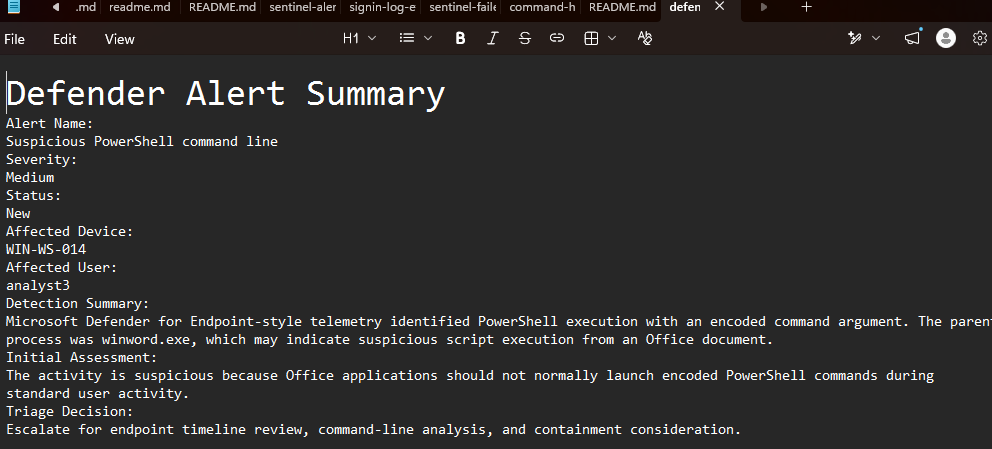
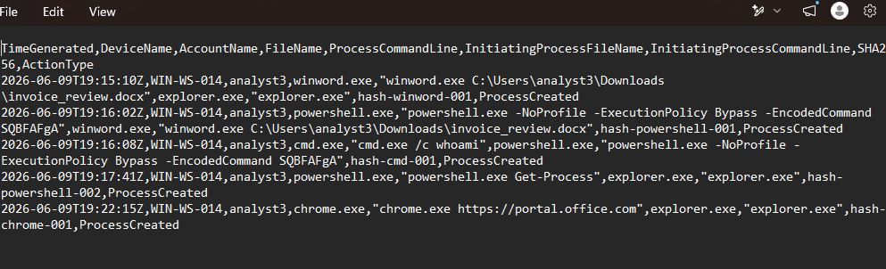
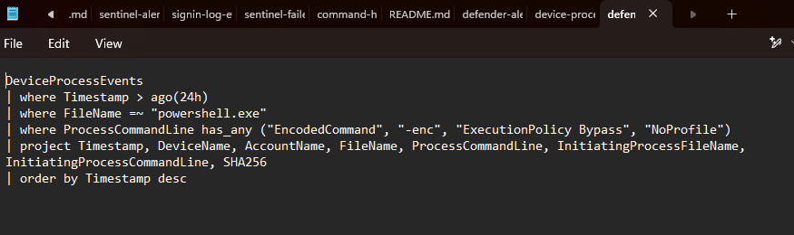

# SOC-012 Microsoft Defender EDR Alert Investigation

## Recruiter Summary

This simulated endpoint investigation demonstrates how I would triage a medium-severity Microsoft Defender for Endpoint alert involving an Office application spawning encoded PowerShell. I reviewed the process chain, separated suspicious activity from likely benign activity, documented the evidence, mapped the observed behavior to MITRE ATT&CK, and recommended approval-controlled next steps.

## Simulation Boundary

This is a controlled portfolio case built from simulated Microsoft Defender-style telemetry. No live Microsoft Defender tenant, production endpoint, real employee account, or company data was accessed. Hostnames, usernames, hashes, timestamps, and process events are fictional lab values.

## Investigation Objective

Determine whether the process activity warranted escalation by reviewing:

- Alert severity and affected entity context
- Parent and child process relationships
- Encoded and bypass-style PowerShell arguments
- Nearby process activity
- KQL-style hunting logic
- Evidence gaps and response options

## Tools and Data Sources

- Microsoft Defender for Endpoint concepts
- Microsoft Defender Advanced Hunting KQL
- Simulated `DeviceProcessEvents` telemetry
- PowerShell and CSV evidence review
- MITRE ATT&CK

## Investigation Workflow

1. Reviewed the Defender-style alert summary.
2. Identified the simulated device and user context.
3. Examined the `winword.exe` to `powershell.exe` process chain.
4. Reviewed `-NoProfile`, `ExecutionPolicy Bypass`, and `EncodedCommand` arguments.
5. Checked child process and nearby process activity.
6. Compared the suspicious chain with a separate, lower-risk `Get-Process` event.
7. Reviewed the KQL query for repeatable hunting logic.
8. Documented the disposition and approval-controlled recommendations.

## Key Findings

- `winword.exe` launched `powershell.exe` on the simulated endpoint.
- PowerShell used `-NoProfile`, `ExecutionPolicy Bypass`, and `EncodedCommand`.
- PowerShell then launched `cmd.exe /c whoami`.
- A separate PowerShell `Get-Process` event launched by `explorer.exe` appeared less suspicious.
- The Office-to-encoded-PowerShell chain justified escalation for deeper endpoint review.

## Analyst Disposition

**Escalate for additional endpoint investigation.**

The available simulated evidence supports a suspicious assessment, but it does not by itself prove malware execution, credential compromise, persistence, or lateral movement. No containment action was performed.

## MITRE ATT&CK Mapping

- **T1059.001 - Command and Scripting Interpreter: PowerShell**  
  Directly supported by the observed PowerShell process activity.
- **T1027 - Obfuscated Files or Information**  
  Supported by the use of an encoded PowerShell command argument.

## Recommended Next Steps

These are analyst recommendations requiring authorized human review:

- Review the complete endpoint timeline around the process chain.
- Decode and inspect the full PowerShell command in an approved analysis environment.
- Validate the source document and its delivery method.
- Check for file creation, network activity, persistence, and related alerts.
- Consider endpoint isolation or account action only if additional evidence confirms malicious activity and approval is granted.

## Evidence

### Alert Summary

The alert summary records the medium-severity detection, affected simulated endpoint, and escalation rationale.

### Process Events

The event data shows the Office-to-PowerShell process chain, encoded arguments, child process activity, and comparison events.

### Investigation Query

The KQL-style query filters PowerShell activity for encoded commands, bypass flags, and related suspicious arguments.

## Supporting Files

- [Alert summary](evidence/alert-summary.md)
- [Simulated process events](evidence/process-events.csv)
- [Investigation query](queries/investigation-query.kql)
- [PowerShell review commands](COMMANDS.md)

## Skills Demonstrated

- Microsoft Defender EDR alert triage
- Endpoint process-chain analysis
- PowerShell command-line review
- KQL-style threat hunting
- Evidence-based escalation
- MITRE ATT&CK mapping
- Public-safe incident documentation
