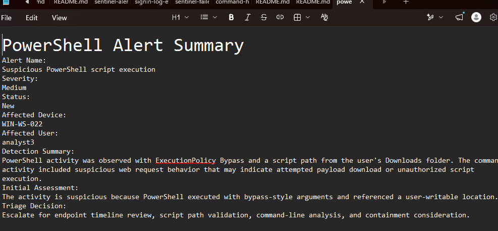
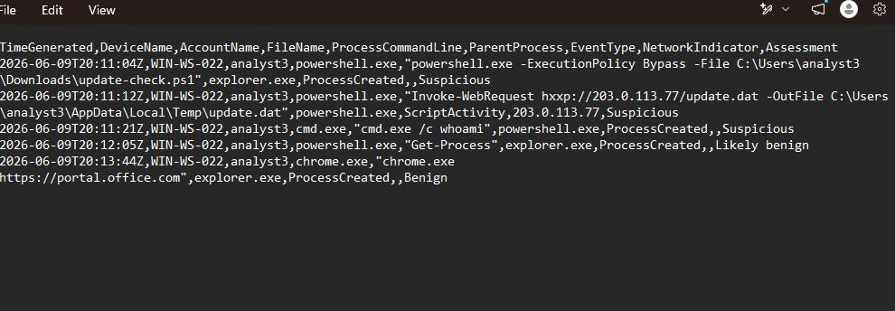
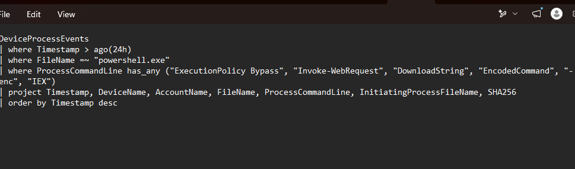

# SOC-013 PowerShell Suspicious Script Investigation

## Recruiter Summary

This simulated SOC case demonstrates investigation of suspicious PowerShell activity involving `ExecutionPolicy Bypass`, a script launched from a user-writable folder, an `Invoke-WebRequest` command, and a child command-shell process. I reviewed the event sequence, distinguished suspicious activity from likely benign PowerShell usage, documented the evidence, and produced an escalation decision with approval-controlled response options.

## Simulation Boundary

This is a controlled portfolio case built from simulated Windows endpoint telemetry. No production endpoint, live SIEM, real Defender tenant, employee account, or company data was accessed. The hostname, username, timestamp, and reserved example IP address are fictional lab values.

## Investigation Objective

Determine whether the PowerShell sequence represented expected administration or suspicious script and attempted file-retrieval activity by reviewing:

- Command-line arguments and script path
- Parent and child processes
- Simulated network indicator context
- Nearby benign activity
- KQL-style hunting logic
- Evidence gaps and escalation criteria

## Tools and Data Sources

- PowerShell
- Windows endpoint investigation concepts
- Microsoft Defender Advanced Hunting KQL
- Simulated process and script activity
- CSV evidence review
- MITRE ATT&CK

## Investigation Workflow

1. Reviewed the simulated PowerShell alert summary.
2. Identified the affected simulated endpoint and user.
3. Examined the script path and `ExecutionPolicy Bypass` argument.
4. Reviewed the `Invoke-WebRequest` activity and output path.
5. Checked the child `cmd.exe /c whoami` process.
6. Compared the sequence with separate `Get-Process` and browser activity.
7. Reviewed the KQL query for repeatable hunting logic.
8. Documented the disposition and approval-controlled recommendations.

## Key Findings

- PowerShell launched a script from the simulated user's `Downloads` folder.
- The command used `ExecutionPolicy Bypass`.
- A later PowerShell event recorded an `Invoke-WebRequest` command that referenced a temporary-directory output file.
- PowerShell spawned `cmd.exe /c whoami`.
- A separate `Get-Process` event appeared likely benign and was not treated as equivalent to the suspicious sequence.

## Analyst Disposition

**Escalate for script validation and expanded endpoint review.**

The simulated activity is suspicious and consistent with attempted payload retrieval, but the evidence does not prove successful execution, persistence, credential theft, or lateral movement. No endpoint, account, or network containment action was performed.

## MITRE ATT&CK Mapping

- **T1059.001 - Command and Scripting Interpreter: PowerShell**  
  Directly supported by the observed PowerShell process and command activity.
- **T1105 - Ingress Tool Transfer**  
  The recorded `Invoke-WebRequest` command is consistent with an attempted ingress tool transfer. No transfer-success evidence was available.

## Recommended Next Steps

These are analyst recommendations requiring authorized human review:

- Validate the script file, origin, hash, signer, and expected business use.
- Review the complete endpoint timeline before and after the activity.
- If the referenced output file exists, inspect it in an approved analysis environment.
- Review related DNS, proxy, EDR, and network telemetry.
- Consider isolation, blocking, or account action only if additional evidence confirms malicious activity and approval is granted.

## Evidence

### Alert Summary

The alert summary records the suspicious arguments, user-writable script location, and escalation rationale.

### PowerShell Events

The event data shows the script execution, web request, child command process, and comparison activity.

### Investigation Query

The KQL-style query filters for bypass arguments, transfer-related command patterns, encoded commands, and related suspicious PowerShell activity.

## Supporting Files

- [Alert summary](evidence/alert-summary.md)
- [Simulated PowerShell events](evidence/powershell-events.csv)
- [Investigation query](queries/investigation-query.kql)
- [PowerShell review commands](COMMANDS.md)

## Skills Demonstrated

- Suspicious PowerShell investigation
- Endpoint event correlation
- Script and attempted transfer behavior analysis
- KQL-style threat hunting
- Benign-versus-suspicious comparison
- Evidence-based escalation
- MITRE ATT&CK mapping
