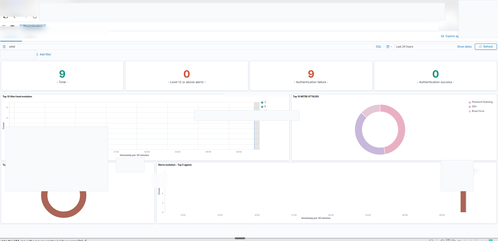
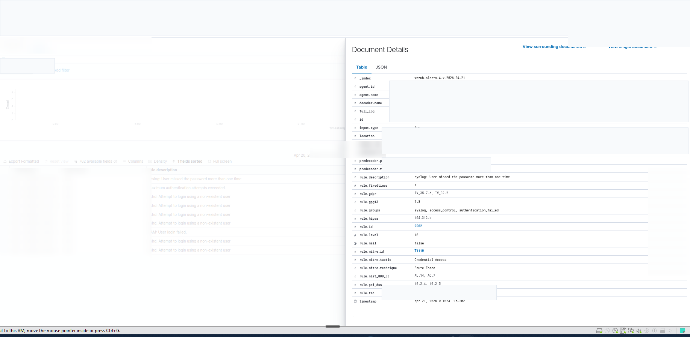
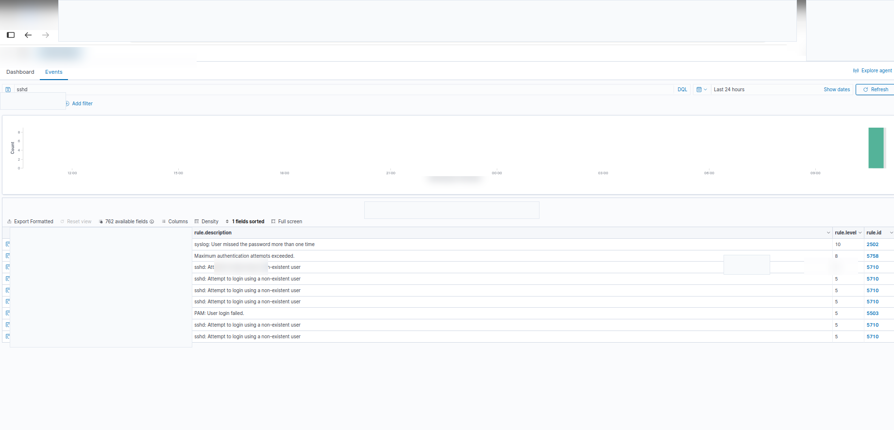
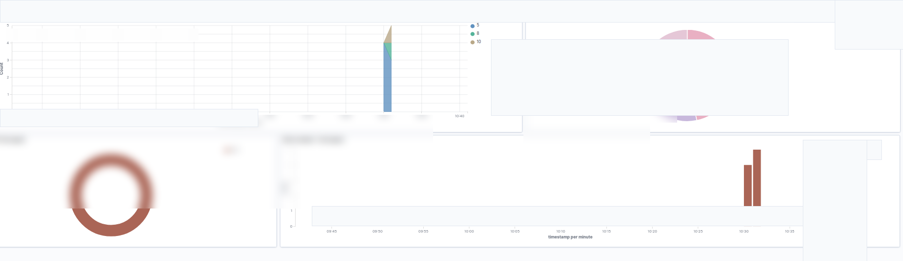
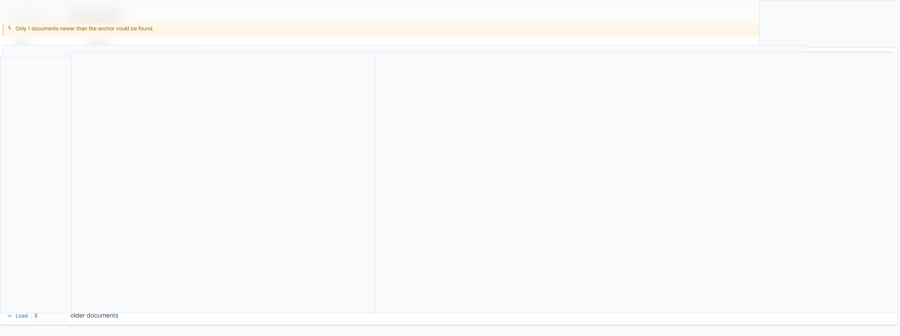
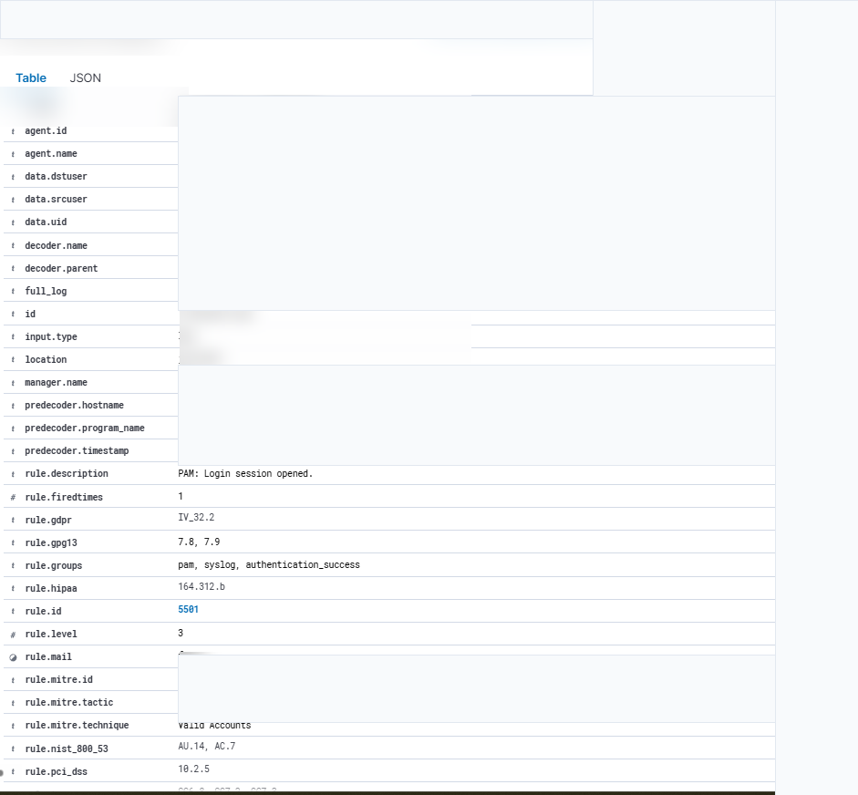

# SOC Alert Triage Lab

## Project Summary

This blue-team lab documents a SOC-style alert triage workflow in Wazuh. The investigation reviewed an alert, opened the event details, checked related authentication activity, and documented whether the observed behavior looked benign, suspicious, or malicious based on the available evidence.

The final documented triage decision was **Monitor / Informational**.

## Objective

Investigate a Wazuh alert and determine whether the event required escalation, additional monitoring, or no immediate response. The review focused on the alert details, related timeline activity, authentication context, and whether the available evidence showed signs of compromise.

## Tools Used

- Wazuh
- Linux system logs / journald context
- PAM authentication event context
- Sudo and local administrative activity review
- Markdown documentation for analyst notes and findings

## Investigation Workflow

1. Reviewed the Wazuh alert overview.
2. Opened the raw event details.
3. Checked the affected host, user, source context, and alert fields.
4. Reviewed related events and timeline activity.
5. Correlated surrounding authentication and PAM events.
6. Investigated successful local login session activity tied to `pkexec` and sudo-related events.
7. Determined whether the systemd failure appeared isolated or related to broader suspicious activity.
8. Documented the triage decision and supporting evidence.

## Key Findings

- Wazuh detected a level 5 event tied to a local systemd service failure.
- The event originated from local journald logs on the Wazuh manager host.
- The affected service was `xdg-permission-store.service`.
- The service exited with `status=1/FAILURE`.
- Related PAM login session events showed successful local authentication activity for the root account initiated by the `tren` user account.
- MITRE ATT&CK mappings included Valid Accounts (T1078) and privilege escalation-related tactics.
- No evidence of authentication abuse, malicious persistence, or remote compromise was identified from the documented event alone.
- The observed activity appeared consistent with expected administrative behavior during local system usage.

## Triage Decision

**Decision:** Monitor / Informational

**Reason:** The documented event indicates a local service failure rather than clear malicious activity. Related authentication and sudo activity was reviewed, but the available notes did not identify direct evidence of compromise. Continued monitoring is appropriate in case similar service failures, authentication events, or privilege-related activity repeat.

## Why This Matters for SOC Work

SOC analysts often review alerts that contain security-relevant context but do not automatically prove compromise. This lab shows the process of checking the alert details, surrounding authentication activity, and timeline context before making a measured triage decision.

## Evidence and Screenshots

The screenshots below are GitHub candidate copies stored under `evidence/screenshots-public/`. They are included to show the review flow while keeping the original raw screenshots local-only.

### Wazuh Alert Overview

Dashboard view showing the authentication-related alert set that started the triage review.

### Authentication Failure Event Details

Raw Wazuh event details for the failed-login context reviewed alongside the service-failure alert.

### Failed Login Pattern Review

Filtered Wazuh results used to check whether authentication failures repeated or appeared isolated.

### Service-Failure Alert Fields

Field-level view for the systemd service-failure alert, including host, source, and timestamp context.

### Related Event Timeline

Timeline view used to compare the service-failure event against nearby authentication, PAM, and sudo activity.

### PAM Session Context

PAM session details reviewed to determine whether local privilege-related activity looked expected or suspicious.

## Supporting Documentation

- [Investigation notes](docs/investigation.md)
- [Findings](docs/findings.md)
- [Investigation queries](queries/investigation-queries.txt)

## Skills Demonstrated

- SOC alert triage
- Wazuh alert review
- Authentication event analysis
- PAM and sudo activity correlation
- Timeline review
- Basic MITRE ATT&CK mapping awareness
- Evidence organization for public portfolio documentation
- Analyst-style findings and triage decision writing

## Local-Only Note

The `outputs/` folder, `SOC_Triage_HANDOFF.md`, and any LinkedIn draft files are local-only working artifacts. They are not part of this public README and should not be treated as GitHub-ready evidence without separate review and approval.
