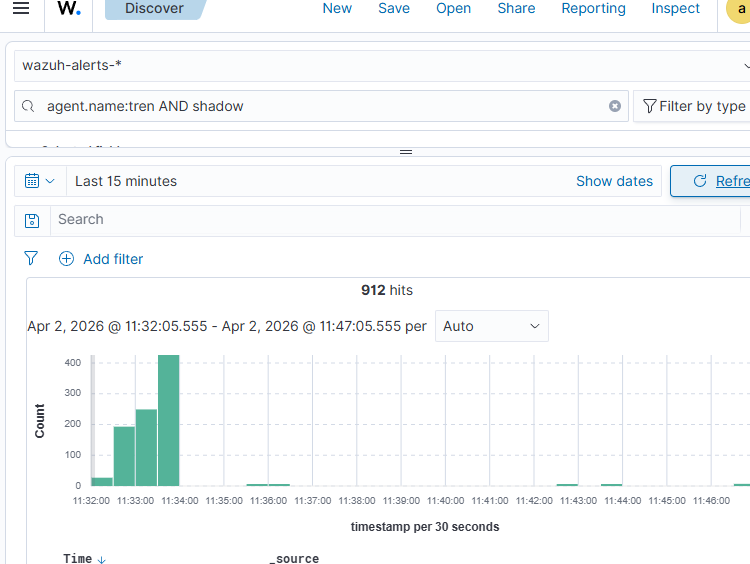
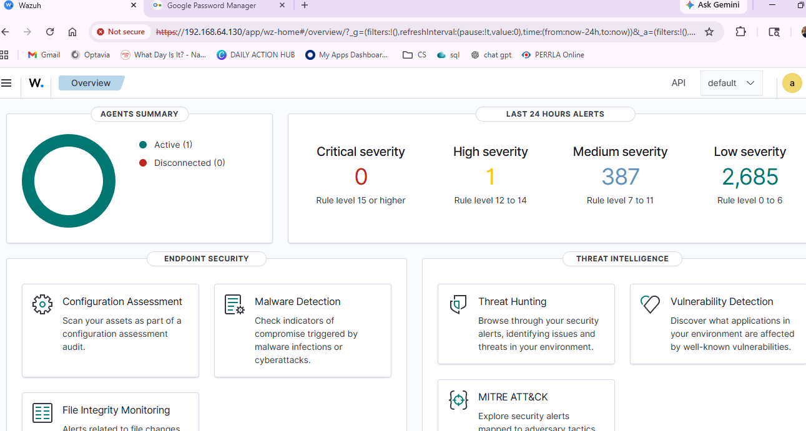
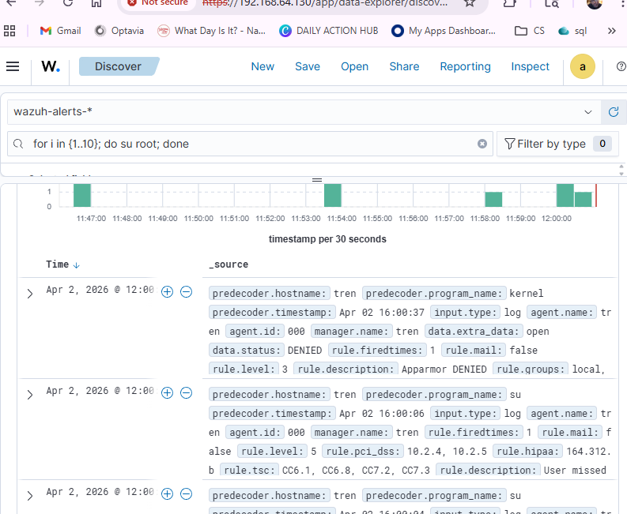
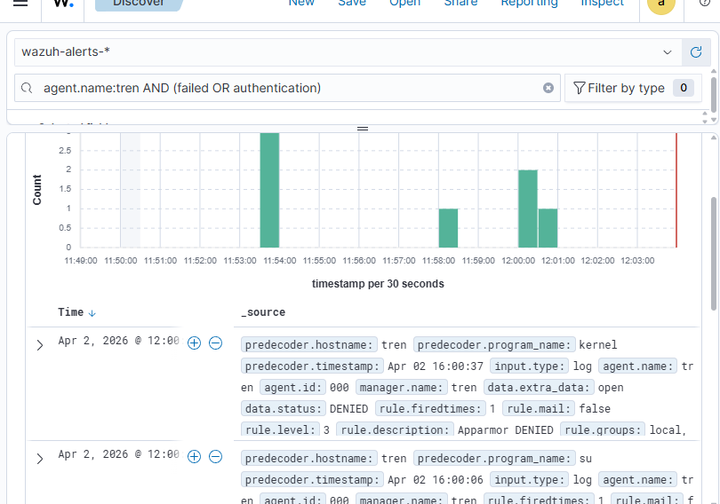

# Threat Hunting with Wazuh

A home lab simulating attacker activity and detecting it in real time using Wazuh SIEM. Covers the full blue team workflow: environment setup, agent deployment, attack simulation, alert triage, and documented findings.

---

## Environment

| Machine | Role | OS |
|---|---|---|
| Wazuh Server | SIEM / Manager | Ubuntu |
| Target | Monitored endpoint | Ubuntu |
| Attacker | Attack simulation | Kali Linux |

---

## Objectives

- Deploy Wazuh agents across multiple endpoints
- Simulate brute force and suspicious activity from Kali Linux
- Detect and triage alerts in the Wazuh dashboard
- Document findings using SOC analyst methodology

---

## What Was Done

**1. Wazuh setup and agent deployment**
Stood up a Wazuh manager on Ubuntu and enrolled target endpoints as monitored agents. Verified agent connectivity and log ingestion from the Wazuh overview dashboard.

**2. Attack simulation**
Ran brute force and reconnaissance activity from a Kali Linux attacker machine against the monitored Ubuntu target to generate detectable events.

**3. Alert detection and triage**
Used the Wazuh dashboard to identify triggered alerts, reviewed rule IDs and severity levels, and traced events back to source IPs and timestamps.

---

## Screenshots

| Screenshot | Description |
|---|---|
|  | Wazuh manager dashboard showing monitored agents and alert summary |
|  | Enrolled agents reporting to the Wazuh manager |
|  | Kali Linux terminal running the simulated attack |
|  | Wazuh alert triggered by brute force activity |

---

## Key Takeaways

- Wazuh rule 5763 (multiple authentication failures) fires reliably on SSH brute force within seconds of activity starting
- Agent enrollment and log forwarding requires correct `ossec.conf` configuration on the endpoint — a misconfigured agent silently fails to forward
- Timestamp correlation between attacker terminal and SIEM alert confirmed sub-10-second detection latency in this lab environment

---

## Skills Demonstrated

- SIEM deployment and agent management
- Threat simulation in a controlled environment
- Alert triage and event correlation
- SOC-style documentation of findings
