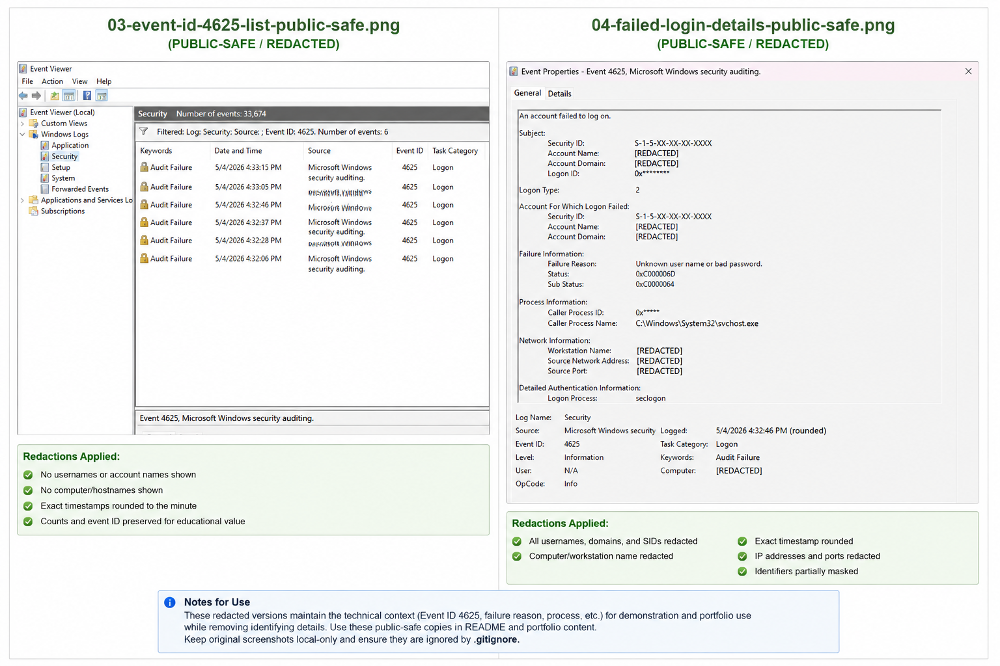

# Windows Log Analysis — Failed Login Investigation (Event ID 4625)

## Overview
Investigated Windows Security logs to analyze failed login attempts using Event ID 4625.

This project focuses on identifying authentication failures, understanding logon behavior, and determining whether activity represents a real threat or benign behavior.

---

## What Happened
Multiple failed login attempts were observed in the Windows Security log.

- Event ID: 4625 (Failed logon)
- Number of attempts: Multiple within a short time frame
- Event Type: Audit Failure

The activity triggered repeated authentication failure events, requiring investigation.

---

## Investigation Process

### 1. Log Identification
Accessed Windows Event Viewer and filtered Security logs for Event ID 4625.

### 2. Event Analysis
Reviewed event details to extract:
- Target account
- Logon type
- Failure reason
- Source address
- Process responsible

### 3. Pattern Recognition
Observed repeated login attempts targeting the same account.

### 4. Validation
Confirmed:
- No successful login events occurred
- Activity was generated locally
- Failure reason indicated invalid credentials

---

## Key Evidence

- Target Account: `FakeUser`
- Logon Type: `2` (Interactive login)
- Failure Reason: `Unknown user name or bad password`
- Source Address: `::1` (localhost)
- Process: `svchost.exe`

---

## Evidence Screenshots

The public-safe screenshot below shows the Event ID `4625` filter results and redacted failed-login event details. It preserves the investigation evidence while avoiding public exposure of usernames, hostnames, or IP addresses.

---

## Logon Type Breakdown

- **2 (Interactive):** Local login via keyboard/login screen  
- **3 (Network):** Remote/network login  
- **10 (Remote Interactive):** RDP login  

This investigation involved **Logon Type 2**, indicating local activity.

---

## Analysis

The failed login attempts were directed at a non-existent account (`FakeUser`).

The source address (`::1`) confirms the activity originated from the same system.

The logon type (2) indicates local login attempts rather than remote access.

This behavior is consistent with:
- User error  
- Testing/simulated activity  
- Non-malicious failed authentication attempts  

---
## Key Findings

- Multiple Windows failed login events were identified using Event ID 4625.
- The targeted account was `FakeUser`.
- The failure reason was `Unknown user name or bad password`.
- The logon type was `2`, indicating an interactive local login attempt.
- The source address was `::1`, confirming the activity originated from localhost.
- No successful authentication was observed.
- The activity was assessed as low risk because it was local, simulated, and did not result in compromise.

## Security Impact

- **Risk Level:** Low  
- No successful authentication occurred  
- No evidence of external access attempts  

If similar activity originated from:
- External IP addresses  
- Logon Type 3 or 10  

…it would indicate a higher risk scenario such as brute force or credential attack.

---

## Why This Matters

Event ID 4625 is one of the most important logs in Windows security monitoring.

SOC analysts use it to:
- Detect brute force attempts  
- Identify suspicious login behavior  
- Investigate potential account compromise  

Understanding how to interpret these logs is critical for real-world security operations.

For SOC work, this kind of review shows how an analyst uses logon type, source address, account context, and successful-login checks to avoid over-escalating benign local activity while still recognizing what would make the same event higher risk.

---

## Outcome

Successfully:
- Identified and filtered failed login events  
- Analyzed authentication failure details  
- Determined the activity was local and non-malicious  
- Applied SOC-level reasoning to assess risk  

This project demonstrates the ability to:
- Work with Windows Security logs  
- Interpret authentication events  
- Differentiate between malicious and benign activity  
- Think like a SOC analyst  

---

## Tools Used
- Windows Event Viewer

## Local-Only Files

Raw screenshots, generated outputs, HANDOFF files, and LinkedIn drafts are kept local-only and are not part of the GitHub-ready evidence set.
