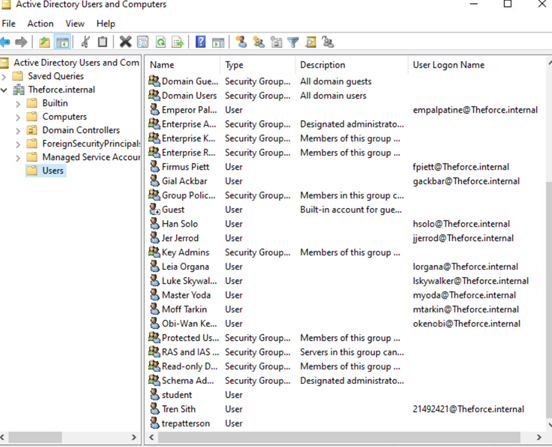
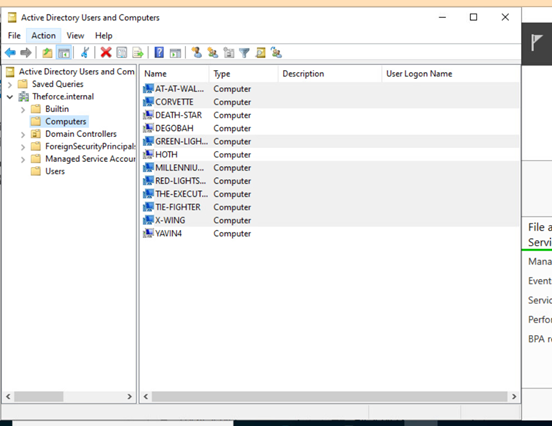
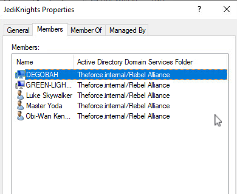
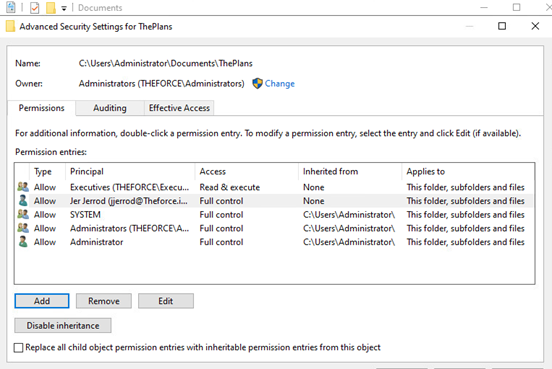
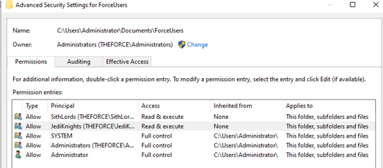

# 🏆 Featured Project: Active Directory Enterprise Lab

## 🧠 Project Overview
This project simulates a real-world enterprise environment using Windows Active Directory. It demonstrates identity management, access control, organizational structuring, and security policy enforcement.

This lab reflects practical skills used by system administrators, cybersecurity analysts, and IT security professionals in enterprise networks.

---

## 🎯 Objectives
- Create and manage Active Directory users and computers  
- Design and implement Organizational Units (OUs)  
- Configure security groups and assign permissions  
- Enforce access control using least privilege principles  
- Implement Group Policy Objects (GPOs) for security enforcement  

---

## 🛠️ Technologies Used
- Windows Server  
- Active Directory Users and Computers  
- Group Policy Management  
- NTFS Permissions  

---

## 🏗️ Environment Setup
A simulated enterprise domain environment was created with structured Organizational Units:
- Rebel Alliance  
- Galactic Empire  

Each OU contains users, computers, and security groups to represent different departments.

---

## 👥 Identity & Access Management

### User and Computer Creation
Users and computer objects were created and organized within Active Directory.

---

## 🗂️ Organizational Structure

Organizational Units were used to logically separate resources:

- Rebel Alliance OU  
- Galactic Empire OU  

---

## 🔐 Role-Based Access Control (RBAC)

Security groups were created to manage permissions efficiently:

### Rebel Alliance
- JediKnights  
- Leadership  
- RebelForces  

### Galactic Empire
- SithLords  
- Executives  
- GalacticForces  

---

## 🔑 Access Control Implementation

Permissions were configured to enforce:
- Least privilege  
- Controlled access to resources  
- Secure delegation of permissions  

---

## ⚙️ Advanced Security Configuration

Granular permissions were configured based on the following rules:
- Critical objects cannot be deleted  
- Access cannot be restricted between opposing groups  
- Permissions allow continued data growth  

---

## 🛡️ Group Policy Enforcement

A Group Policy Object (GPO) was created to enforce logon messaging:

---

## 📊 Key Skills Demonstrated
- Active Directory Administration  
- Identity and Access Management (IAM)  
- Role-Based Access Control (RBAC)  
- Group Policy Configuration  
- Security Policy Enforcement  

---

## 💡 Lessons Learned
- Proper directory structure simplifies management  
- Security groups reduce administrative overhead  
- GPOs enforce consistency across systems  
- Access control must balance usability and security  

---

## 🚀 Real-World Relevance
This project mirrors enterprise-level Active Directory environments used in corporate networks. The skills demonstrated are directly applicable to roles such as:

- Cybersecurity Analyst  
- System Administrator  
- IT Support Specialist  
- Identity & Access Management Analyst

- ## Project Outcomes

This project demonstrated the ability to configure and manage an Active Directory environment in a structured and secure way. Key outcomes included:

- Creating and organizing users and computer objects
- Building Organizational Units to separate administrative domains
- Assigning security groups to support role-based access control
- Configuring NTFS permissions to protect shared resources
- Applying Group Policy to enforce user-facing security settings

---

⭐ *This project represents hands-on experience with enterprise identity and access management systems.*
