# 🖥️ Windows Active Directory Lab

## 📌 Overview
This lab demonstrates the configuration and management of Active Directory components including users, computers, organizational units (OUs), security groups, permissions, and Group Policy Objects (GPOs).

---

## 🛠️ Tools Used
- Windows Server
- Active Directory Users and Computers
- Group Policy Management

---

## 👤 User Creation
Users were created and configured with appropriate logon names.

---

## 💻 Computer Objects
Computer objects were created and added to Active Directory.

---

## 🗂️ Organizational Units (OUs)
Organizational Units were created to logically group users and resources.

---

## ⚔️ OU Assignment

### Rebel Alliance OU
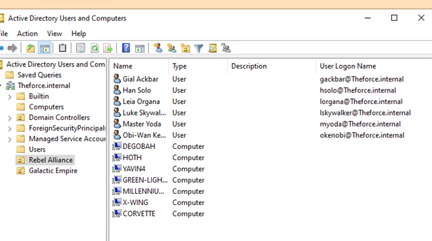

### Galactic Empire OU
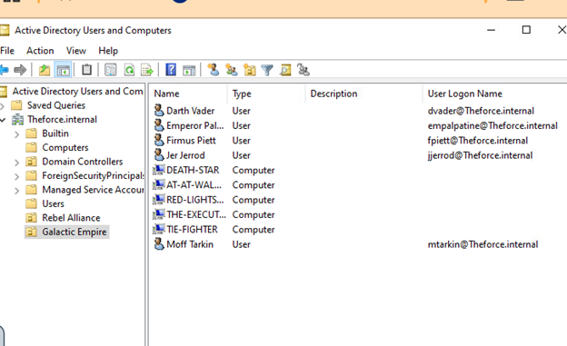

---

## 🔐 Security Groups

### Rebel Alliance Groups
- JediKnights  

- Leadership  
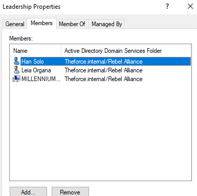

- RebelForces  
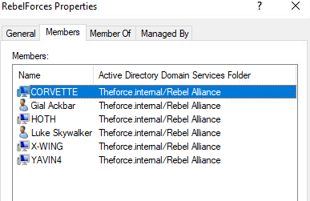

---

### Galactic Empire Groups
- SithLords  
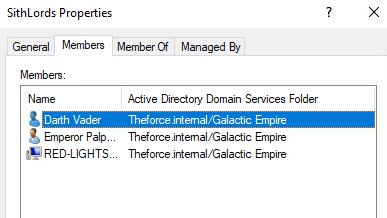

- Executives  
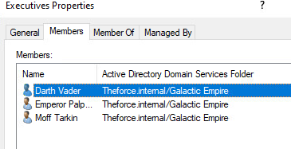

- GalacticForces  
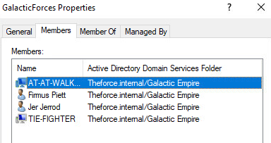

---

## 🔑 Access Control
Permissions were assigned to users and groups, including granting Full Control access.

---

## ⚙️ Advanced Permissions
Granular permissions were configured based on requirements:
- Objects cannot be deleted  
- Access cannot be restricted by opposing groups  
- Permissions support continuous knowledge growth  

### SithLords Permissions

### JediKnights Permissions
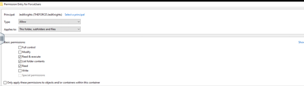

---

## 🛡️ Group Policy Objects (GPO)

A logon message policy was created for the Rebel Alliance.

### Title Configuration
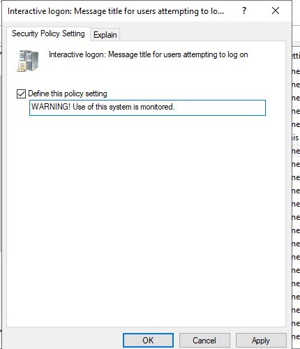

### Message Configuration
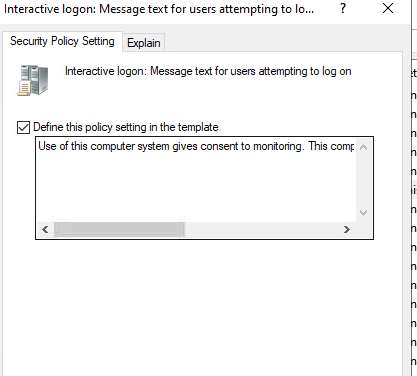

### Policy Applied
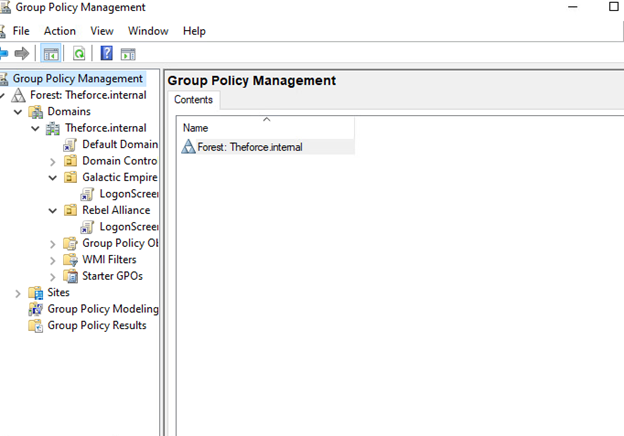

---

## 🧠 Key Takeaways
- Active Directory is critical for managing enterprise environments  
- Organizational Units help structure and manage resources  
- Security groups simplify permission management  
- Group Policy enforces security settings across systems  
- Proper access control is essential for security and compliance  

---

## 📸 Screenshots
All screenshots document the configuration and validation of Active Directory components.