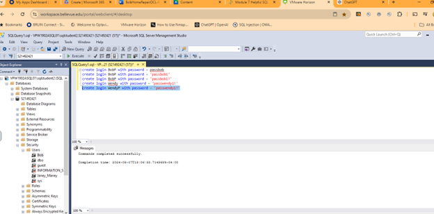
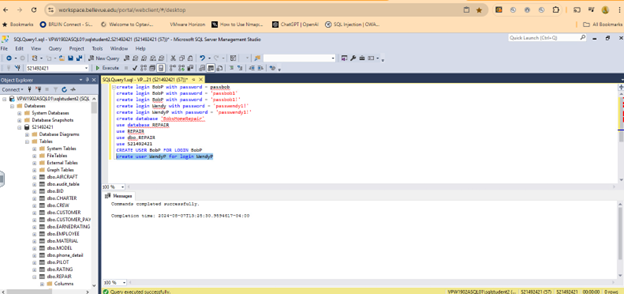
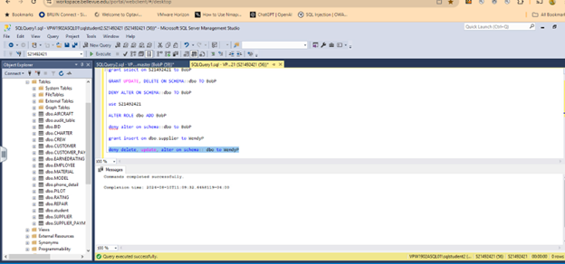

# 🗄️ Database User Permissions Lab

## 📌 Overview
This lab demonstrates the creation of database users, logins, and the assignment of permissions for different users. The goal was to control access and enforce security through proper role-based permissions.

---

## 🛠️ Tools Used
- SQL Server / Database Management Tool
- SQL Commands

---

## 👥 User & Login Creation

### Bob and Wendy Accounts
Users and corresponding logins were created for:
- Bob
- Wendy

---

## 🔐 Login Configuration
Logins were configured to allow access to the database system.

---

## 🔑 Permissions Assignment

### Bob's Permissions
Permissions were assigned to Bob (BobP) based on required access.

---

### Wendy's Permissions
Permissions were assigned to Wendy (WendyP) with appropriate access levels.

---

## ✅ Verification of Permissions
Permissions were verified to ensure correct access levels were applied.

---

## 🧠 Key Takeaways
- Proper user and login creation is essential for database security  
- Permissions should follow the principle of least privilege  
- Verifying permissions ensures security policies are enforced  
- Role-based access control helps prevent unauthorized access  

---

## ⚠️ Notes
This lab highlights the importance of managing user access in a database environment to protect sensitive data and maintain system integrity.