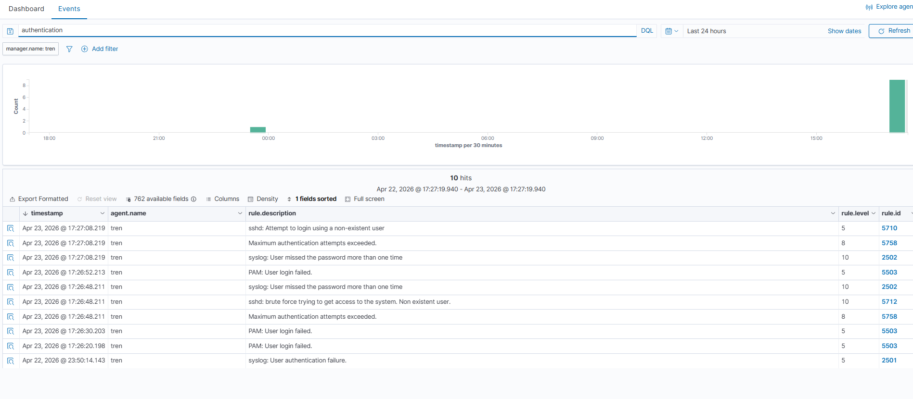
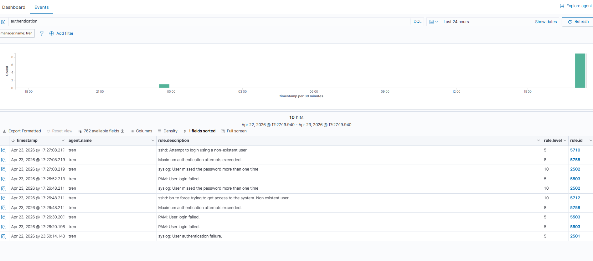
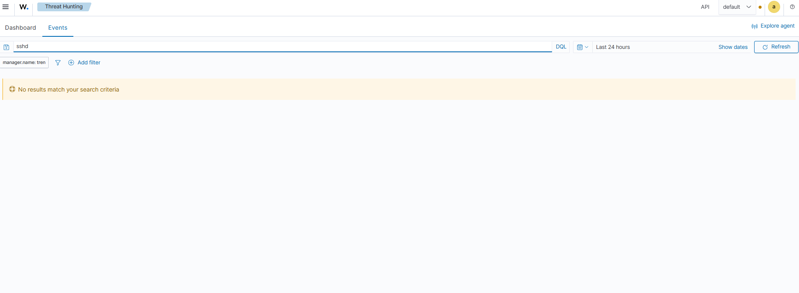

# Threat Hunting Wazuh Bruteforce Detection

## Overview
A detection engineering exercise utilizing the Wazuh platform to identify and analyze a brute force attack on an Ubuntu Linux VM. The investigation focused on repeated failed login attempts using SSH, demonstrating pattern recognition skills essential for effective threat hunting.

## Objective
The objective of this lab was to demonstrate the ability to perform threat hunting activities within the Wazuh platform, identify a brute force attack, and correlate multiple events into a pattern.

## Tools Used
- [Wazuh](https://www.wazuh.com/)

## Environment / Lab Setup
The lab environment consisted of an Ubuntu Linux VM running the Wazuh platform for threat hunting purposes. The specific configuration and setup details are not provided due to missing evidence.

## Investigation Steps
1. Initiated a threat hunting session within the Wazuh Events view.
2. Searched authentication logs for failed login attempts using SSH.
3. Identified repeated failed login behavior from the same user and source IP.
4. Analyzed the timing between the failed login attempts, noting their rapid succession.
5. Correlated multiple events into a pattern, confirming brute force activity.
6. Documented findings, including the number of failed login attempts (approximately 10).

## Key Findings
- Brute force attack pattern identified through pattern recognition and event correlation.
- Approximately 10 failed login attempts from the same user and source IP.
- Rapid timing between the failed login attempts, indicating automated brute force activity.

## Security Impact
The detected brute force attack poses a potential security risk by attempting to gain unauthorized access to the system. If successful, an attacker could potentially compromise sensitive data or services.

## MITRE ATT&CK Mapping
- T1110: Brute Force

## 📸 Evidence

### Failed Login Activity

### Pattern Detection

### Event Details

